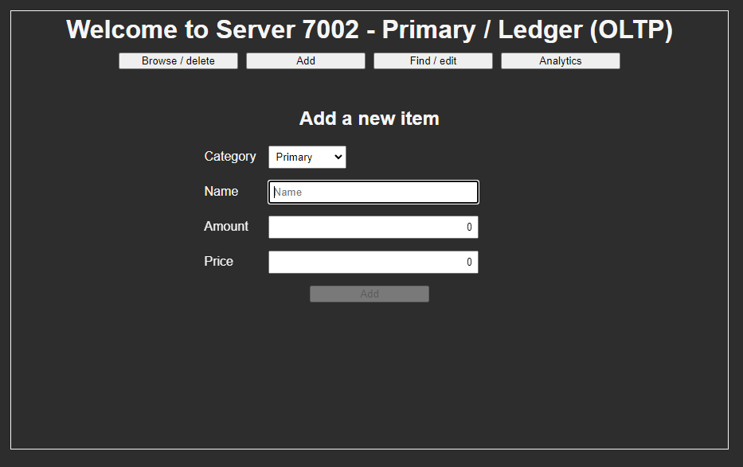
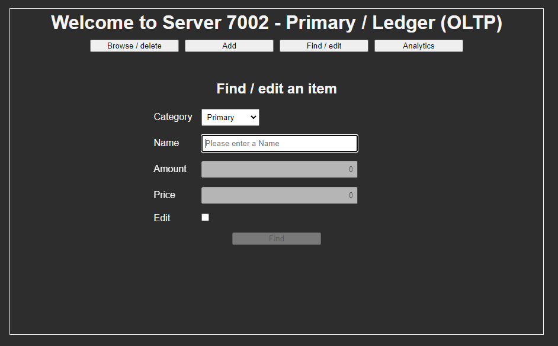

# spring-demos-parent

## Purpose

- Experiment with various tech

## Learning resources

- Solace docs
  - https://docs.solace.com/Solace-PubSub-Platform.htm
- Solace core concepts
  - https://docs.solace.com/Basics/Core-Concepts.htm
- Solace endpoints
  - https://docs.solace.com/Basics/Endpoints.htm#Durable_Endpoint_Access_Types
- Solace JCSMP best practices
  - https://docs.solace.com/Solace-PubSub-Messaging-APIs/API-Developer-Guide/Java-API-Best-Practices.htm
- Solace HA docker-compose
  - https://github.com/SolaceLabs/solace-ha-docker-compose
- Maven Protocol Buffers Plugin
  - https://www.xolstice.org/protobuf-maven-plugin/index.html
- JUnit 5 docs
  - https://junit.org/junit5/docs/current/user-guide
- Mockito docs
  - https://javadoc.io/doc/org.mockito/mockito-core/latest/org/mockito/Mockito.html
- Flyway docs
  - https://flywaydb.org/documentation

## Create an environment variable for Sonar Scanner & pom.xml usage 
 
- Windows configuration

```
# Set a variable
setx SPRING_DEMOS_SONAR_URL <url>
setx SPRING_DEMOS_SONAR_TOKEN <token>

# View a variable
reg query HKEY_CURRENT_USER\Environment

# Unset a variable
reg delete HKEY_CURRENT_USER\Environment /v SPRING_DEMOS_SONAR_URL /f
reg delete HKEY_CURRENT_USER\Environment /v SPRING_DEMOS_SONAR_TOKEN /f

# Check a variable
mvn clean install
```

## Project schema

### Primary

#### Ledger (OLTP)

- Server 7002 Angular
- Server 7003 WebFlux + WebClient
- Server 7004 WebFlux + Solace
- Server 7005 WebFlux + Solace
- Server 7006 Redis
- Server 7007 PostgreSQL 

### Secondary

#### Analytics (OLAP)

- Server 8002 Angular
- Server 8003 WebFlux + Solace
- Server 8004 PostgreSQL

### Tertiary 

#### Hibernate

- Server 9001 WebFlux
- Server 9002 PostgreSQL

#### SonarQube

- Server 20001/2 SonarQube
- Server 20003 PostgreSQL

#### Solace

- Server 8080 HAProxy
- Server 212 Solace Primary
- Server 312 Solace Backup
- Server 412 Solace Monitoring

```
               Server 7002 
                 Angular
                    |
               Server 7003 
       WebFlux + WebClient + Caffeine
                    |
               Server 7004                                  Server 8002 
            WebFlux + Solace                                  Angular
                    |                                            |
                    ----------------------------------------------
                    |                     |                      |
               Server 7005                |                 Server 8003
            WebFlux + Solace              |              WebFlux + Solace 
                    |                     |                      |
         -----------------------          |                 Server 8004
         |                     |          |                  PostgreSQL
    Server 7006           Server 7007     |                 
       Redis               PostgreSQL     |
                                          |
                                     Server 8080
                                       HAProxy
                                          |
                       -----------------------------------------
                       |                  |                    |
                   Server 212         Server 312           Server 412
                 Solace Primary      Solace Backup      Solace Monitoring


    Server 20001/2          Server 9001
      SonarQube               WebFlux  
          |                      |     
     Server 20003           Server 9002
      PostgreSQL             PostgreSQL
```

## Feature schema

### Create item

- Create an item on Server 7005 and add stats on Server 8003
- On duplicate error on Server 7005 send a compensatory operation to Server 8003
- Features: Sync/blocking (JCSMP), Eventual consistency, Durable, Exclusive, Byte transfer (Google Protobuf)

```
                    ---- create item ----> Server 7005 --- duplicate error ----
                    |                                                         |
    Server 7004 --- |                                                         |
                    |                                                         |
                    ---- add stats ------> Server 8003 <--- substract stats ---
```



### Get item

- Send a name to Server 7005
- Receive an item from Server 7004
- Features: Sync/blocking (JCSMP), Non-durable (Direct), Exclusive, Byte transfer (Google Protobuf)

```
                    ------- send name ------> (request)
                    |                       |
    Server 7004 --- |                       | --- Server 7005
                    |                       |
            (reply) <------- get item -------           
```

- Cached at both upstream Server 7003 with Caffeine and using Redis at Server 7004
- Caffeine caches a parametrized Mono from the WebFlux
- Redis caches a byte array from the protocol buffer

```
    Server 7003 <---- M2M WebClient HTTP GET request ----> Server 7005 
        |                                                      |
    In-memory                                              Server 7006
     Caffeine                                                Redis
``` 



## Google protobuf schema for Solace event messaging

```protobuf
syntax = "proto3";

package com.downvoteit.springgpb;

option java_multiple_files = true;
option java_package = "com.downvoteit.springgpb";

message ItemRequest {
  int32 id = 1;
  int32 categoryId = 2;
  string name = 3;
  int32 amount = 4;
  double price = 5;
}

message ItemResponse {
  int32 id = 1;
  string message = 2;
}

message ItemNameRequest {
  string name = 1;
}
```

## Hibernate entities for persistence

### Primary

```java
@Data
@Builder
@AllArgsConstructor
@NoArgsConstructor
@Entity(name = "categories")
@Table(name = "categories")
@Inheritance(strategy = InheritanceType.JOINED)
public class Category {
  @Id
  @GeneratedValue(strategy = GenerationType.SEQUENCE, generator = "categories_id_seq")
  @GenericGenerator(
      name = "categories_id_seq",
      strategy = "org.hibernate.id.enhanced.SequenceStyleGenerator")
  private Integer id;

  @Column(name = "name")
  private String name;
}

@Data
@Builder
@AllArgsConstructor
@NoArgsConstructor
@Entity(name = "items")
@Table(name = "items")
@Inheritance(strategy = InheritanceType.JOINED)
public class Item {
  @Id
  @GeneratedValue(strategy = GenerationType.SEQUENCE, generator = "items_id_seq")
  @GenericGenerator(
      name = "items_id_seq",
      strategy = "org.hibernate.id.enhanced.SequenceStyleGenerator")
  private Integer id;

  @OneToOne
  private Category category;

  @Column(name = "name")
  private String name;

  @Column(name = "amount")
  private Integer amount;

  @Column(name = "price")
  private Double price;
}

@Getter
@Setter
@AllArgsConstructor
@NoArgsConstructor
@EqualsAndHashCode(callSuper = false)
@Entity(name = "store_items")
public class StoreItem extends Item {
  @Column(name = "store_name")
  private String storeName;
}

@Getter
@Setter
@AllArgsConstructor
@NoArgsConstructor
@EqualsAndHashCode(callSuper = false)
@Entity(name = "warehouse_items")
public class WarehouseItem extends Item {
  @Column(name = "warehouse_name")
  private String warehouseName;
}
```

#### Secondary

```java
@Data
@Builder
@AllArgsConstructor
@NoArgsConstructor
@Entity(name = "items_categories")
@Table(name = "items_categories")
@Inheritance(strategy = InheritanceType.JOINED)
public class ItemsCategory {
  @Id
  @GeneratedValue(strategy = GenerationType.SEQUENCE, generator = "items_categories_id_seq")
  @GenericGenerator(
      name = "items_categories_id_seq",
      strategy = "org.hibernate.id.enhanced.SequenceStyleGenerator")
  private Integer id;

  @Column(name = "name")
  private String name;

  @Column(name = "amount")
  private Integer amount;

  @Column(name = "price")
  private Double price;
}
```

## DTO POJOs for Machine-to-Machine WebClient HTTP communication

```java
@Data
@Builder
@AllArgsConstructor
@NoArgsConstructor
public class ItemCorKeyDto {
  private Integer id;
  private volatile boolean acked;
  private volatile boolean published;
}

@Data
@Builder
@AllArgsConstructor
@NoArgsConstructor
public class ItemRequestDto {
  private Integer id;
  private Integer categoryId;
  private String name;
  private Integer amount;
  private Double price;
}

@Data
@Builder
@AllArgsConstructor
@NoArgsConstructor
public class ItemResponseDto {
  private Integer id;
  private String message;
}
```

## Flyway versioned schema for centralized SQL management

```postgresql
-- V1__Create_categories_items_table.sql
create table categories
(
    id   serial not null
        constraint categories_pkey primary key,
    name varchar(255),
    unique (name)
);

create table items
(
    id          serial not null
        constraint items_pkey primary key,
    category_id int,
    name        varchar(255),
    amount      integer default 0,
    price       double precision,
    unique (name),
    constraint items_fkey
        foreign key (category_id)
            references categories (id)
);

alter table categories
    owner to postgres;
alter table items
    owner to postgres;

-- V2__Insert_categories_table.sql
insert into categories (id, name)
values (1, 'Primary'),
       (2, 'Secondary'),
       (3, 'Tertiary');

alter sequence categories_id_seq restart with 4;

-- V3__Insert_items_table.sql
insert into items (id, category_id, name, amount, price)
values (nextval('items_id_seq'), 1, 'Test primary', 1, 10.0),
       (nextval('items_id_seq'), 2, 'Test secondary', 2, 20.0),
       (nextval('items_id_seq'), 3, 'Test tertiary', 3, 30.0);

-- V4__Create_store_items_table.sql
create table store_items
(
    id          serial not null
        constraint store_items_pkey primary key,
    category_id int,
    name        varchar(255),
    store_name  varchar(255),
    amount      integer default 0,
    price       double precision,
    unique (name),
    constraint store_items_fkey
        foreign key (category_id)
            references categories (id)
);

create table warehouse_items
(
    id             serial not null
        constraint warehouse_items_pkey primary key,
    category_id    int,
    name           varchar(255),
    warehouse_name varchar(255),
    amount         integer default 0,
    price          double precision,
    unique (name),
    constraint warehouse_items_fkey
        foreign key (category_id)
            references categories (id)
);

alter table store_items
    owner to postgres;
alter table warehouse_items
    owner to postgres;
```

## Notes

### Solace

- JMS API is for direct, non-durable (not guaranteed) messaging 
- JCSMP API is for mostly sync/blocking, low-latency messaging that can be affected by GC intervals
- Java RTO API is for async/non-blocking, extremely low-latency messaging that relies on C wrapper and manual memory management

### WebFlux

- WebFlux cannot be cached with Redis without stopping the event-loop (blocking & rescheduling)
- WebFlux can be cached with Caffeine but using a deprecated CacheMono types

### Hibernate

- Entities involved into batch operations must use `@GeneratedValue(GenerationType.SEQUENCE, generator=...)`
- During a batch operation calling `flush()` and `clear()` on an EntityManager will clear the PersistenceContext to avoid an OOM 
