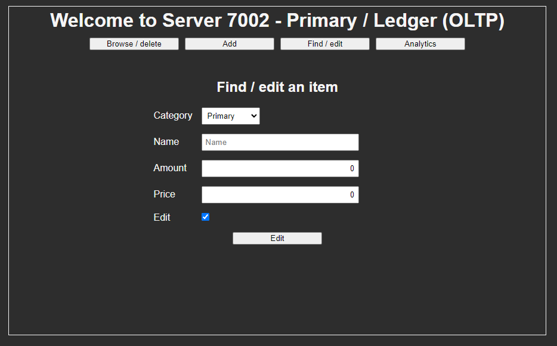

# spring-demos-parent

## Purpose

- Experiment with various tech

## Learning resources

- Solace docs
  - https://docs.solace.com/Solace-PubSub-Platform.htm
- Solace core concepts
  - https://docs.solace.com/Basics/Core-Concepts.htm
- Solace endpoints
  - https://docs.solace.com/Basics/Endpoints.htm#Durable_Endpoint_Access_Types
- Solace JCSMP best practices
  - https://docs.solace.com/Solace-PubSub-Messaging-APIs/API-Developer-Guide/Java-API-Best-Practices.htm
- Solace HA docker-compose
  - https://github.com/SolaceLabs/solace-ha-docker-compose
- Maven Protocol Buffers Plugin
  - https://www.xolstice.org/protobuf-maven-plugin/index.html
- JUnit 5 docs
  - https://junit.org/junit5/docs/current/user-guide
- Mockito docs
  - https://javadoc.io/doc/org.mockito/mockito-core/latest/org/mockito/Mockito.html
- Flyway docs
  - https://flywaydb.org/documentation

## Create an environment variable for Sonar Scanner & pom.xml usage 
 
- Windows configuration

```
# Set a variable
setx SPRING_DEMOS_SONAR_URL <url>
setx SPRING_DEMOS_SONAR_TOKEN <token>

# View a variable
reg query HKEY_CURRENT_USER\Environment

# Unset a variable
reg delete HKEY_CURRENT_USER\Environment /v SPRING_DEMOS_SONAR_URL /f
reg delete HKEY_CURRENT_USER\Environment /v SPRING_DEMOS_SONAR_TOKEN /f

# Check a variable
mvn clean install
```

## Project schema

### Primary

#### Ledger (OLTP)

- Server 7002 Angular
- Server 7003 WebFlux + WebClient
- Server 7004 WebFlux + Solace
- Server 7005 WebFlux + Solace
- Server 7006 Redis
- Server 7007 PostgreSQL 

### Secondary

#### Analytics (OLAP)

- Server 8002 Angular
- Server 8003 WebFlux + Solace
- Server 8004 PostgreSQL

### Tertiary 

#### Nginx

- Server 7001 Nginx

#### Hibernate

- Server 9001 WebFlux
- Server 9002 PostgreSQL

#### SonarQube

- Server 7008/9 SonarQube
- Server 7010 PostgreSQL

#### Solace

- Server 55555 HAProxy
- Server 212 Solace Primary + SolAdmin (7011)
- Server 312 Solace Backup
- Server 412 Solace Monitoring

```     
                                     Server 7001
                                        Nginx
                                          |
                    ----------------------------------------------
                    |                                            |
               Server 7002                                       |
                 Angular                                         |
                    |                                            |
               Server 7003                                       |
       WebFlux + WebClient + Caffeine                            |
                    |                                            |
               Server 7004                                  Server 8002 
            WebFlux + Solace                                  Angular
                    |                                            |
                    ----------------------------------------------
                    |                     |                      |
               Server 7005                |                 Server 8003
            WebFlux + Solace              |              WebFlux + Solace 
                    |                     |                      |
         -----------------------          |                 Server 8004
         |                     |          |                  PostgreSQL
    Server 7006           Server 7007     |                 
       Redis               PostgreSQL     |
                                          |
                                     Server 55555
                                       HAProxy
                                          |
                   -------------------------------------------------
                   |                      |                        |
               Server 212             Server 312               Server 412
             Solace Primary          Solace Backup          Solace Monitoring
                SolAdmin                                    

    Server 7008/9      Server 9001
     SonarQube           WebFlux  
         |                  |     
    Server 7010        Server 9002
     PostgreSQL         PostgreSQL
```

## Feature schema

### Create item

- Create an item on Server 7005 and add stats on Server 8003
- On duplicate error on Server 7005 send a compensatory operation to Server 8003
- Features: Sync/blocking (JCSMP), Persistent (Durable), Exclusive, Byte transfer (Google Protobuf), Eventually consistent

```
                    ---- create item ----> Server 7005 --- duplicate error ----
                    |                                                         |
    Server 7004 --- |                                                         |
                    |                                                         |
                    ---- add stats ------> Server 8003 <--- substract stats ---
```


### Update item

- TODO description & schemas



### Get item

- Send category id & name to Server 7005
- Receive an item from Server 7004
- Features: Sync/blocking (JCSMP), Direct (Non-durable), Exclusive, Byte transfer (Google Protobuf)

```
                    -------------- send category id & name --------------> (request)
                    |                                                    |
    Server 7004 --- |                                                    | --- Server 7005
                    |                                                    |
            (reply) <-------------------- get item -----------------------           
```

- Cached at both upstream Server 7003 with Caffeine and using Redis at Server 7004
- Caffeine caches a parametrized Mono from the WebFlux
- Redis caches a byte array returned from the Solace broker in the form of a protocol buffer

```
    Server 7003 <---- M2M WebClient HTTP GET request ----> Server 7005 
        |                                                      |
    In-memory                                              Server 7006
     Caffeine                                                Redis
``` 


### Get items

- Send a page & limit to Server 7005
- Receive an item from Server 7004
- Features: Sync/blocking (JCSMP), Direct (Non-durable), Exclusive, Byte transfer (Google Protobuf)

```
                    ------- send page & limit ------> (request)
                    |                               |
    Server 7004 --- |                               | --- Server 7005
                    |                               |
            (reply) <--------- get items ------------           
```

- Not cached at either Server 7003 (Caffeine) or Server 7004 (Redis)


### Delete item

- TODO description & schemas


### Get items category

- TODO description & schemas


## Notes

### Solace

- JMS API is for direct, durable/non-durable (not guaranteed) messaging 
- JCSMP API is for mostly sync/blocking, low-latency messaging that can be affected by GC intervals
- Java RTO API is for async/non-blocking, extremely low-latency messaging that relies on C wrapper and manual memory management
- Front-/client-facing get data requests must use non-durable queues
- Queues are generally recommended for durable messaging
- Topics can be configured for non-durable messaging
- Topic subscriptions allow for complex filtering at the level of the broker
- An exclusive queue allows receiving messages in Active-Standby/backup fashion
- A non-exclusive queue allows receiving message in round-robin/competing fashion
- Flow receivers are for persistent endpoints
- Cache sessions are for direct endpoints

### WebFlux

- WebFlux cannot be cached with Redis without stopping the event-loop (blocking & rescheduling) and caching the wrapper (Mono/Flux) itself
- WebFlux can be cached with Caffeine but using a deprecated CacheMono types

### Hibernate

- Entities involved in batch operations must use `@GeneratedValue(GenerationType.SEQUENCE, generator=...)` generator
- During a batch operation calling `flush()` and `clear()` on an EntityManager will clear the PersistenceContext to avoid an OOM 
